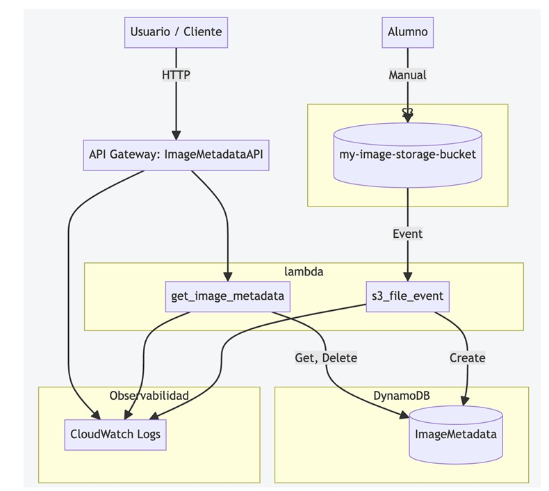

\# 🖼️ ImageMetadataAPI – Proyecto Serverless en AWS

Arquitectura del sistema




\## 📘 Descripción


Este proyecto implementa una API serverless en AWS que permite almacenar, consultar y eliminar metadatos de imágenes subidas a un bucket S3. Utiliza servicios gestionados como Lambda, DynamoDB, S3 y API Gateway, y se despliega automáticamente con Terraform.


\## 🧠 Arquitectura


\- \*\*S3\*\*: Almacena imágenes en la carpeta `uploads/`

\- \*\*Lambda (s3\_file\_event)\*\*: Se activa al subir o eliminar imágenes en `uploads/`, y sincroniza los metadatos en DynamoDB

\- \*\*DynamoDB\*\*: Guarda `image\_id`, `bucket` y `size` de cada imagen

\- \*\*Lambda (get\_image\_metadata)\*\*: Expone endpoints para consultar y eliminar metadatos

\- \*\*API Gateway\*\*: Publica la API REST con métodos `GET` y `DELETE`


\## 📁 Estructura del proyecto


image-metadata-api/ ├── terraform/ │ ├── main.tf │ ├── variables.tf │ ├── terraform.tfvars ├── lambdas/ │ ├── get\_image\_metadata/ │ │ ├── lambda\_function.py │ │ └── function.zip │ └── s3\_file\_event/ │ ├── lambda\_function.py │ └── function.zip ├── deploy.sh ├── README.md


\## ⚙️ Requisitos


\- Cuenta AWS con rol `LabRole`

\- AWS CLI configurado

\- Terraform instalado

\- Git Bash o terminal compatible con `.sh`

\- Python 3.9 para funciones Lambda


\## 🚀 Despliegue automático


1\. Clona el repositorio

2\. Abre Git Bash en la carpeta raíz

3\. Ejecuta:


```bash

chmod +x deploy.sh

./deploy.sh


Terraform usará los valores definidos en terraform.tfvars


bucket\_name       = "my-image--storage-bucket"

table\_name        = "ImageMetadata"

lambda\_role\_arn   = "arn:aws:iam::730335546358:role/LabRole"


Endpoints disponibles


Método	Ruta	Descripción

GET	/metadata	Lista todos los metadatos

GET	/metadata/{image\_id}	Consulta metadatos por ID

DELETE	/metadata/{image\_id}	Elimina metadatos por ID


Pruebas sugeridas

Subir imagen a S3 → carpeta uploads/

Se activa s3\_file\_event y se guarda en DynamoDB

Consultar metadatos en Postman:

GET /metadata → lista completa

GET /metadata/uploads/logo.jpg → consulta específica

Eliminar imagen desde S3 → carpeta uploads/

Se activa s3\_file\_event y se elimina de DynamoDB

Eliminar metadatos manualmente:

DELETE /metadata/uploads/logo.jpg → desde Postman

Validación técnica

✅ ZIPs correctamente empaquetados con lambda\_function.py

✅ Eventos S3 configurados con prefijo uploads/

✅ CloudWatch Logs muestran eventos ObjectCreated y ObjectRemoved

✅ DynamoDB refleja sincronización precisa

✅ API Gateway responde correctamente a pruebas en Postman


